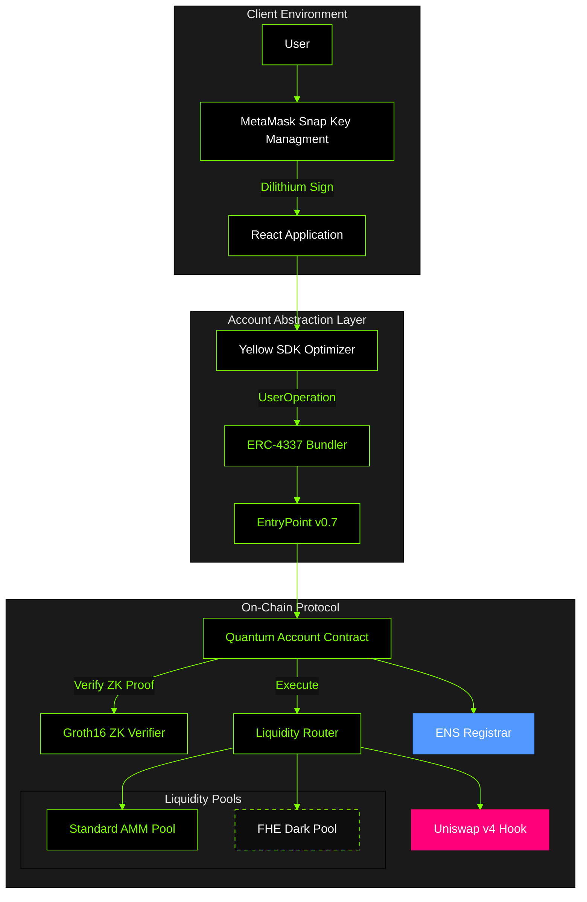

<div align="center">
  
  <h1>Quantum Pools</h1>
  <h3>A Quantum-Resistant, Privacy-Preserving Automated Market Maker</h3>
  
  <p>
    <b>Built for HackMoney 2026</b> • Deployed on <b>Sepolia Testnet</b>
  </p>
  
  <p>
    <a href="https://quantum-pools.vercel.app/">Live Interface</a> • 
    <a href="https://deepwiki.com/YASH-ai-bit/quantum-safe-pools">Documentation</a> • 
    <a href="https://www.npmjs.com/package/quantum-pools-snap">NPM Package</a>
  </p>
</div>

---

## System Abstract

Quantum Pools is a decentralized exchange protocol designed to mitigate the systemic risks posed by quantum computing while addressing the privacy limitations of public ledger automated market makers (AMMs). The protocol integrates three novel technologies:

1.  **Post-Quantum Cryptography (PQC)**: Utilizes the NIST-standardized CRYSTALS-Dilithium signature scheme for quantum-resistant authentication.
2.  **Fully Homomorphic Encryption (FHE)**: Enables the execution of AMM invariants on encrypted data, preventing miner extractable value (MEV) and preserving trader privacy.
3.  **Account Abstraction (ERC-4337)**: Abducts complex cryptographic operations into a seamless user experience via smart contract wallets and batched operations.

## Ecosystem Integrations

We leverage best-in-class infrastructure to deliver a robust, production-ready experience.

| Partner | Integration | Purpose |
| :--- | :--- | :--- |
| **Uniswap v4** | **Dynamic Fee Hooks** | We implement a custom Hook (`QuantumDynamicFeeHook.sol`) that adjusts swap fees based on volatility and user registration status, protecting LPs from toxic flow while incentivizing privacy. |
| **Yellow** | **Intent Solver SDK** | The Yellow SDK optimizes `UserOperation` construction, batching sequential intents (e.g., `Approve` → `Swap`) into atomic transactions and providing pre-confirmation guarantees. |
| **ENS** | **Quantum Identity** | Every Quantum Account is issued a unique `.quantumtest.eth` subdomain via our custom Registrar, binding human-readable identities to post-quantum keys. |

## Technical Architecture

The architecture utilizes a hybrid off-chain/on-chain model where sensitive key operations occur in a secure client enclave (MetaMask Snap), while verification and execution occur on-chain via zero-knowledge proofs and encrypted state machines.



### 1. Lattice-Based Cryptography (Dilithium)

The core security component is the implementation of CRYSTALS-Dilithium 2, a lattice-based signature scheme resistant to Shor's algorithm.

*   **Key Generation**: Performed within the isolated execution environment of a MetaMask Snap (`quantum-pools-snap`) to ensure key material never leaves the user's secure context.
*   **Signature Compression**: To minimize on-chain gas costs, we do not verify the raw 2.4KB Dilithium signature on Ethereum. Instead, we generate a Groth16 zk-SNARK proof attesting to the validity of the signature.
*   **Verification Efficiency**: The `QuantumAccount` smart contract verifies this constant-size zk-SNARK proof, reducing verification cost from ~3,000,000 gas (estimated for raw verification) to ~200,000 gas for the first verification, and significantly less when batched.

### 2. Confidential State Machine (FHE)

The Dark Pool component utilizes Fully Homomorphic Encryption (FHE) to operate on encrypted states. The Constant Product Market Maker (CPMM) invariant `x * y = k` is computed over `tfhe.uint` types.

#### Implementation Strategy

We employ a unified interface that supports both testnet simulation and production FHE environments:

**Testnet Configuration (Sepolia)**
```solidity
import "./mocks/MockTFHE.sol"; // Plaintext simulation for gas profiling
```

**Production Configuration (Inco/Zama)**
```solidity
import "fhevm/lib/TFHE.sol"; // Homomorphic encryption execution
```

The system supports standard FHE operations (`TFHE.add`, `TFHE.mul`, `TFHE.le`) to ensure that liquidity provider balances and user swap amounts solely exist as ciphertexts on-chain.

### 3. Account Abstraction & Yellow SDK

We leverage ERC-4337 to provide a unified interface for interacting with both quantum and privacy features. The **Yellow SDK** is a client-side library that optimizes `UserOperation` construction. It identifies dependent sequential operations (e.g., `Token.approve()` followed by `Router.swap()`) and batches them into a single atomic transaction.

#### Batching Example

```javascript
// Yellow SDK automatically bundles dependent operations
const batch = new YellowBatch();
batch.add(factory.interface.encodeFunctionData('createPool', [tokenA, tokenB]));
batch.add(router.interface.encodeFunctionData('addLiquidity', [tokenA, tokenB, amountA, amountB]));

// Executes as a single atomic UserOperation
await quantumAccount.executeBatch(batch);
```

### Gas Analysis & Benchmarks

The following benchmarks demonstrate the efficiency gains from the Yellow SDK and the cost profile of FHE operations.

#### Yellow SDK Efficiency

| Operation | Standard (EOA) | Yellow SDK (Batched) | Gas Savings |
| :--- | :--- | :--- | :--- |
| **Create Pool + Add Liq** | 2 txs (~400k gas) | 1 UserOp (~280k gas) | **30%** |
| **Multi-Swap (3x)** | 3 txs (~360k gas) | 1 UserOp (~250k gas) | **31%** |
| **Approve + Swap** | 2 txs (~200k gas) | 1 UserOp (~145k gas) | **27%** |

#### Protocol Overhead

| Operation | Public Pool | Dark Pool (Mock FHE) | Dark Pool (Real FHE) | Use Case |
| :--- | :--- | :--- | :--- | :--- |
| **Add Liquidity** | ~150k gas | ~200k gas | ~3,000k gas | Initial seeding |
| **Swap** | ~120k gas | ~150k gas | ~8,000k gas | Private exchange |
| **Remove Liquidity** | ~130k gas | ~180k gas | ~2,500k gas | Position exit |

*Note: The gas premium for Real FHE is justified by the institutional-grade privacy it affords, effectively preventing value loss from front-running on large orders.*

## Contract Deployment (Sepolia)

| Component | Address |
| :--- | :--- |
| **QuantumSystem** | `0x7f57fee9f66F74C1D45e3FB4ba1FEFBb1ac9AF04` |
| **Factory** | `0x5E74A87c3Cf7E0B928db9396468885CB8bAa50c5` |
| **Router** | `0x26Fa1CF487280EE756d0BeBA5973aD19d8f6D802` |
| **Verifier** | `0xA98C966bE386760A05a1917626e4032BC93AbB28` |
| **Paymaster** | `0x71877B35abc4D002Ffe6eCc32E7c02FEbBc9FC96` |

## Development Setup

### Prerequisites
*   Node.js v18+
*   Yarn package manager
*   Foundry (Forge)

### Installation

```bash
# Clone the repository
git clone https://github.com/YASH-ai-bit/quantum-safe-pools
cd quantumpools

# Install Frontend Dependencies
cd frontend && npm install

# Install Snap Package (via NPM)
# No local build required if using the published package
npm install quantum-pools-snap

# Install Contract Dependencies
cd ../contracts && forge install
```

### Local Execution

```bash
# Start the frontend application
cd frontend
npm run dev

# Note: The application will connect to the published Snap on NPM.
# To develop the Snap locally, refer to SNAP_DEVELOPMENT.md
```

## Project Trajectory

**Phase 1: Testnet (Current)**
*   Quantum account implementation (ERC-4337)
*   Dual-track AMM (Public + Dark)
*   Mock FHE integration for rapid iteration

**Phase 2: Production FHE (Q2 2026)**
*   Integrate Zama fhEVM / Inco Network
*   Encrypted Orderbook for OTC matching
*   Mainnet Security Audit

## License

This project is licensed under the **MIT License**.

---

<div align="center">
  <sub>Copyright © 2026 Quantum Pools Team</sub>
</div>
