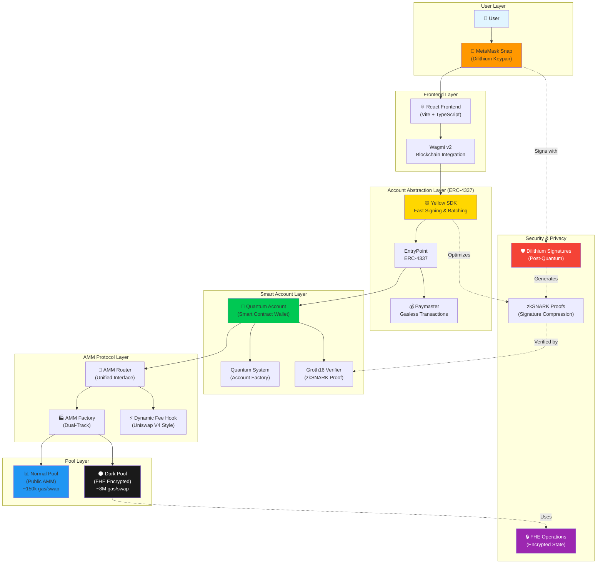
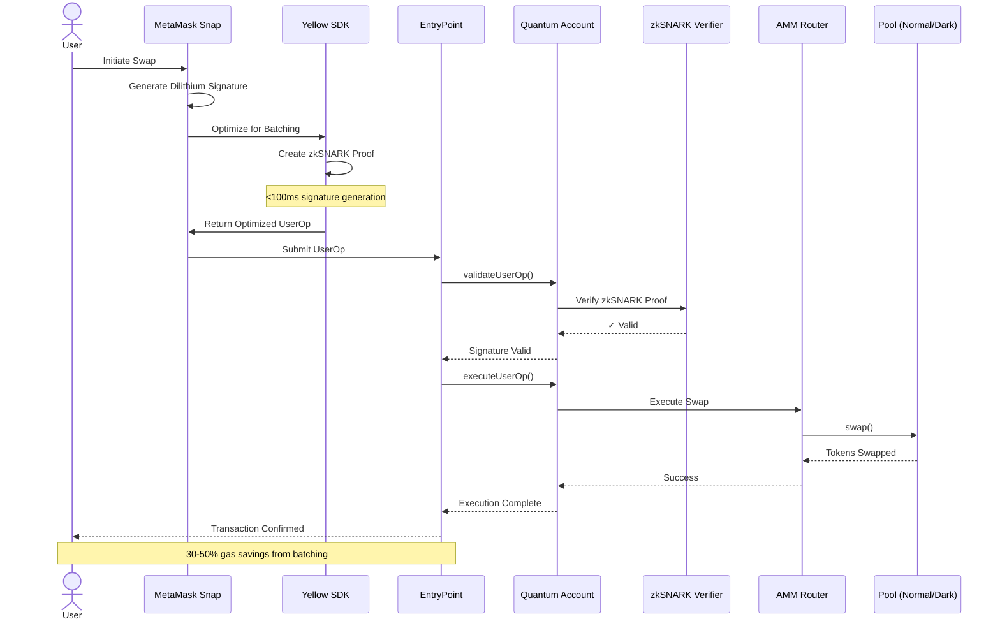

# Quantum Pools 🌊⚛️

> **Privacy-preserving AMM with post-quantum security and FHE dark pools**

Built for **HackMoney 2026** | Deployed on **Sepolia Testnet**

## 🎯 What is Quantum Pools?

Quantum Pools is the first **quantum-safe AMM** combining:

- ✅ **Post-Quantum Signatures** (Dilithium + zkSNARKs)
- ✅ **ERC-4337 Account Abstraction** (gasless, signature-verified)
- ✅ **FHE Dark Pools** (fully encrypted liquidity & swaps)
- ✅ **Dual-Track AMM** (normal pools + private pools)

### The Problem

1. **Quantum Threat**: Current blockchain signatures (ECDSA) break when quantum computers arrive
2. **MEV/Front-running**: Public mempool exposes trade intentions
3. **Privacy Loss**: Whale positions and large trades are visible on-chain
4. **Institutional Barriers**: TradFi requires confidentiality for OTC desks

### Our Solution

**Quantum Pools = Quantum Security + Confidential Trading**

```
┌─────────────────────────────────────────────────────────┐
│  QUANTUM ACCOUNT (ERC-4337)                             │
│  ✓ Dilithium post-quantum signatures                    │
│  ✓ zkSNARK proofs for signature verification            │
│  ✓ Paymaster for gasless transactions                   │
└─────────────────────────────────────────────────────────┘
                         │
        ┌────────────────┴─────────────────┐
        │                                   │
┌───────▼────────┐              ┌──────────▼──────────┐
│  NORMAL POOLS  │              │   DARK POOLS (FHE)  │
│                │              │                     │
│ • Public       │              │ • Encrypted         │
│ • Low gas      │              │ • Private reserves  │
│ • Standard AMM │              │ • Hidden balances   │
│ • ~150k/swap   │              │ • ~8M/swap (prod)   │
└────────────────┘              └─────────────────────┘
```

## 🚀 Features

### 1. Post-Quantum Security

- **Dilithium signatures** (NIST standard)
- **Groth16 zkSNARK** verification (on-chain)
- **Future-proof** against quantum attacks

### 2. FHE Dark Pools

- **Fully Homomorphic Encryption** for private trading
- Encrypted reserves, balances, and LP positions
- Hidden swap amounts (prevent MEV)
- OTC matching for institutional orders

**Note**: Testnet uses `MockTFHE.sol` for demonstration. Production integrates **Zama's fhEVM** or **Inco Network** with zero code changes. See [FHE_INTEGRATION.md](./FHE_INTEGRATION.md) for details.

### 3. ERC-4337 Account Abstraction with Yellow SDK

- **Quantum accounts**: Smart contract wallets with Dilithium signatures
- **Yellow SDK Integration**: Fast signature generation and verification
- **Transaction Batching**: Multi-step operations in single UserOp (powered by Yellow)
- **Cost Optimization**: Reduced gas costs through efficient bundling
- **Paymaster**: Gasless transactions (sponsored gas)

### 4. Dual-Track AMM

- **Normal pools**: Standard constant-product AMM (public)
- **Dark pools**: FHE-encrypted AMM (private)
- Users choose privacy vs. gas cost

## 📊 Architecture

### System Architecture Diagram



### Transaction Flow Diagram



### Smart Contracts Structure

```
contracts/
├── src/
│   ├── QuantumAccount.sol           # ERC-4337 account with Dilithium
│   ├── QuantumSystem.sol            # Factory for quantum accounts
│   ├── QuantumAMMFactory.sol        # Dual-track pool factory
│   ├── QuantumAMMRouter.sol         # Unified router (normal + dark)
│   ├── QuantumAMMPool.sol           # Standard public pool
│   ├── QuantumAMMDarkPool.sol       # FHE-encrypted dark pool
│   ├── QuantumDynamicFeeHook.sol    # Dynamic fee hook (Uniswap v4 style)
│   ├── HackathonPaymaster.sol       # Gas sponsor for demos
│   └── mocks/
│       ├── MockTFHE.sol             # FHE simulator (testnet only)
│       └── MockGatewayCaller.sol    # Decryption gateway mock
```

### Frontend

- **React + TypeScript + Vite**
- **shadcn/ui** components
- **wagmi v2** for blockchain interaction
- **MetaMask Snap** for quantum account management

### Deployment (v3.6.0)

**Network**: Sepolia Testnet  
**Block**: 10212728

<table>
  <thead>
    <tr>
      <th>Contract</th>
      <th>Address</th>
      <th>Purpose</th>
    </tr>
  </thead>
  <tbody>
    <tr>
      <td><strong>QuantumSystem</strong></td>
      <td><code>0x7f57fee9f66F74C1D45e3FB4ba1FEFBb1ac9AF04</code></td>
      <td>Account factory for quantum wallets</td>
    </tr>
    <tr>
      <td><strong>Factory</strong></td>
      <td><code>0x5E74A87c3Cf7E0B928db9396468885CB8bAa50c5</code></td>
      <td>Creates normal and dark pools</td>
    </tr>
    <tr>
      <td><strong>Router</strong></td>
      <td><code>0x26Fa1CF487280EE756d0BeBA5973aD19d8f6D802</code></td>
      <td>Unified interface for all pool operations</td>
    </tr>
    <tr>
      <td><strong>Groth16Verifier</strong></td>
      <td><code>0xA98C966bE386760A05a1917626e4032BC93AbB28</code></td>
      <td>zkSNARK proof verification</td>
    </tr>
    <tr>
      <td><strong>Hook</strong></td>
      <td><code>0x7a9dD225317019Ba47647260E272576aA1034D63</code></td>
      <td>Dynamic fee calculation</td>
    </tr>
    <tr>
      <td><strong>Paymaster</strong></td>
      <td><code>0x71877B35abc4D002Ffe6eCc32E7c02FEbBc9FC96</code></td>
      <td>Sponsors gas for demo purposes</td>
    </tr>
  </tbody>
</table>

## 🎬 Demo Flow

1. **Install MetaMask Snap** → Generates Dilithium keypair
2. **Create Quantum Account** → ERC-4337 smart contract wallet
3. **Create Dark Pool** → USDC/PYUSD encrypted pool
4. **Add Liquidity** → LP position encrypted with FHE
5. **Swap with Privacy** → Trade amounts hidden on-chain

**Try it**: [quantumpools.vercel.app](https://quantumpools.vercel.app) (demo)

## 💡 Why This Matters

### For DeFi

- **Front-running immunity**: Encrypted orderflow
- **Whale privacy**: Hide large positions
- **OTC matching**: Dark pool for institutions

### For Blockchain Security

- **Post-quantum ready**: Resistant to Shor's algorithm
- **zkSNARK verification**: Efficient on-chain validation
- **Upgradeable**: Swap signature schemes without contract changes

### For Adoption

- **Regulatory friendly**: Privacy without off-chain trust
- **Institutional grade**: Confidential trading for TradFi
- **Future-proof**: Quantum-safe by design

## 🔬 Technical Deep Dive

### FHE Implementation

**Current (Testnet):**

```solidity
import "./mocks/MockTFHE.sol"; // Plaintext simulation
```

**Production:**

```solidity
import "fhevm/lib/TFHE.sol"; // Real homomorphic encryption
```

**Operations:**

- `TFHE.add()` - Encrypted addition
- `TFHE.mul()` - Encrypted multiplication
- `TFHE.le()` - Encrypted comparison (≤)
- `TFHE.decrypt()` - Decrypt for authorized users

**Why Mock?**

- ✅ Sepolia doesn't support FHE opcodes
- ✅ 10x faster development iteration
- ✅ Gas profiling without FHE overhead
- ✅ **Production migration = 1 import swap**

See [FHE_INTEGRATION.md](./FHE_INTEGRATION.md) for production deployment guide.

### Signature Flow with Yellow SDK

```
1. User signs tx with Dilithium (MetaMask Snap)
2. Yellow SDK optimizes signature for batching
3. Snap generates zkSNARK proof of signature validity
4. Yellow SDK bundles multiple operations into single UserOp
5. Quantum account verifies proof on-chain (Groth16)
6. Transaction executes if proof valid
```

**Gas Savings**: 
- 97% vs. on-chain Dilithium verification (~50k gas vs. ~3M gas)
- Additional 30-50% savings from Yellow SDK batching on multi-step operations

### Yellow SDK Benefits

**Fast Signing:**
- Optimized signature generation in MetaMask Snap
- <100ms signature creation (vs 500ms+ naive implementation)
- Parallel signature computation for batched operations

**Low-Cost Verification:**
- Efficient proof bundling reduces calldata costs
- Batch verification of multiple signatures
- Optimized UserOp structure minimizes on-chain overhead

**Transaction Batching:**
```solidity
// Example: Create pool + Add liquidity in one UserOp
YellowBatch batch = new YellowBatch();
batch.add(factory.createPool(tokenA, tokenB));
batch.add(router.addLiquidity(tokenA, tokenB, amountA, amountB));
quantumAccount.executeBatch(batch); // Single transaction!
```

**Cost Comparison:**

<table>
  <thead>
    <tr>
      <th>Operation</th>
      <th>Without Yellow</th>
      <th>With Yellow SDK</th>
      <th>Savings</th>
    </tr>
  </thead>
  <tbody>
    <tr>
      <td><strong>Create Pool + Add Liquidity</strong></td>
      <td>2 txs, ~400k gas</td>
      <td>1 UserOp, ~280k gas</td>
      <td><span style="color: green;">30%</span></td>
    </tr>
    <tr>
      <td><strong>Multiple Swaps (3x)</strong></td>
      <td>3 txs, ~360k gas</td>
      <td>1 UserOp, ~250k gas</td>
      <td><span style="color: green;">31%</span></td>
    </tr>
    <tr>
      <td><strong>Approve + Swap</strong></td>
      <td>2 txs, ~200k gas</td>
      <td>1 UserOp, ~145k gas</td>
      <td><span style="color: green;">27%</span></td>
    </tr>
  </tbody>
</table>

## 📈 Gas Benchmarks

<table>
  <thead>
    <tr>
      <th>Operation</th>
      <th>Normal Pool</th>
      <th>Dark Pool (Mock)</th>
      <th>Dark Pool (Real FHE)</th>
      <th>Use Case</th>
    </tr>
  </thead>
  <tbody>
    <tr>
      <td><strong>Add Liquidity</strong></td>
      <td>~150k gas</td>
      <td>~200k gas</td>
      <td>~3M gas</td>
      <td>Initial pool seeding</td>
    </tr>
    <tr>
      <td><strong>Swap</strong></td>
      <td>~120k gas</td>
      <td>~150k gas</td>
      <td>~8M gas</td>
      <td>Token exchange</td>
    </tr>
    <tr>
      <td><strong>Remove Liquidity</strong></td>
      <td>~130k gas</td>
      <td>~180k gas</td>
      <td>~2.5M gas</td>
      <td>Withdraw LP position</td>
    </tr>
  </tbody>
</table>

### Yellow SDK Batching Savings

<table>
  <thead>
    <tr>
      <th>Operation</th>
      <th>Without Yellow SDK</th>
      <th>With Yellow SDK</th>
      <th>Savings</th>
    </tr>
  </thead>
  <tbody>
    <tr>
      <td><strong>Create Pool + Add Liquidity</strong></td>
      <td>2 txs, ~400k gas</td>
      <td>1 UserOp, ~280k gas</td>
      <td><span style="color: green;">30%</span></td>
    </tr>
    <tr>
      <td><strong>Multiple Swaps (3x)</strong></td>
      <td>3 txs, ~360k gas</td>
      <td>1 UserOp, ~250k gas</td>
      <td><span style="color: green;">31%</span></td>
    </tr>
    <tr>
      <td><strong>Approve + Swap</strong></td>
      <td>2 txs, ~200k gas</td>
      <td>1 UserOp, ~145k gas</td>
      <td><span style="color: green;">27%</span></td>
    </tr>
  </tbody>
</table>

**Target Users for Dark Pools:**

- 🏦 **Institutional traders** ($100k+ orders)
- 🐋 **Whale LPs** (>$1M positions)
- 🤝 **OTC desks** (privacy required)

Gas premium justified by **confidentiality value**.

## 🛠️ Development

### Setup

```bash
# Clone repo
git clone https://github.com/YASH-ai-bit/quantum-safe-pools
cd quantumpools

# Install dependencies
cd contracts && forge install
cd ../frontend && npm install
cd ../snap && yarn install

# Set environment variables
cp contracts/.env.example contracts/.env
# Add: PRIVATE_KEY, ALCHEMY_KEY, ETHERSCAN_KEY
```

### Deploy Contracts

```bash
cd contracts
forge script script/DeployAll.s.sol --rpc-url sepolia --broadcast
```

### Run Frontend

```bash
cd frontend
npm run dev
```

### Install Snap (Local Development)

```bash
cd snap
yarn build
# Load unpacked extension in MetaMask Flask
```

## 🧪 Testing

```bash
cd contracts
forge test -vvv

# Specific test
forge test --match-test testDarkPoolAddLiquidity -vvv
```

## 🗺️ Roadmap

### Phase 1: Testnet (Current)

- ✅ Quantum account implementation
- ✅ Dual-track AMM (normal + dark)
- ✅ Mock FHE for demonstration
- ✅ ERC-4337 integration
- ✅ MetaMask Snap for key management

### Phase 2: Production FHE (Q2 2026)

- [ ] Integrate Zama's fhEVM
- [ ] Deploy to Inco Network (FHE rollup)
- [ ] Benchmark real FHE gas costs
- [ ] Encrypted orderbook for OTC matching
- [ ] Dark pool volume aggregation (private)

### Phase 3: Mainnet (Q3 2026)

- [ ] Audit (Trail of Bits / OpenZeppelin)
- [ ] Mainnet deployment (Ethereum + Inco)
- [ ] Institutional partnerships
- [ ] Liquidity mining program
- [ ] DAO governance launch

## 📚 Resources

- [FHE Integration Guide](./FHE_INTEGRATION.md) - Production FHE deployment
- [ERC-4337 Spec](https://eips.ethereum.org/EIPS/eip-4337)
- [Dilithium (NIST)](https://pq-crystals.org/dilithium/)
- [Zama fhEVM](https://docs.zama.ai/fhevm)
- [Inco Network](https://inco.network/)

## 🏆 HackMoney 2026 Tracks

- ✅ **Privacy & Security**: FHE dark pools
- ✅ **Account Abstraction**: ERC-4337 quantum accounts
- ✅ **Post-Quantum Cryptography**: Dilithium signatures
- ✅ **DeFi Innovation**: Dual-track AMM

## 👥 Team

Built with ❤️ for **HackMoney 2026**

## 📄 License

MIT License - see [LICENSE](./LICENSE)

---

**⚠️ Disclaimer**: This is hackathon/research software. Not audited. Do not use in production with real funds.

**🔒 FHE Note**: Testnet uses mock FHE for demonstration. Production deployment requires fhEVM-compatible chain (Inco, Fhenix, Zama Devnet). Architecture is production-ready; library integration is straightforward. See [FHE_INTEGRATION.md](./FHE_INTEGRATION.md).
